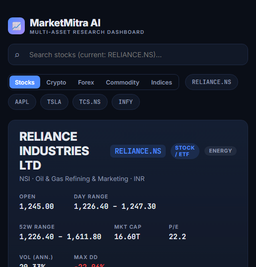

<div align="center">

# 📈 MarketMitra AI

**Multi-asset research dashboard + NSE options analytics + honest AI forecasts.**

Stocks · Indices · Crypto · Forex · Commodities — with a full **options chain**,
**IV smile**, **max pain**, **strategy payoff builder**, a **market scanner +
sector heatmap**, and a **multi-horizon AI forecast** that shows real confidence
ranges instead of a fake single number.

Built end-to-end: **FastAPI** backend · **React + Vite** frontend · **58 offline
tests** · **Docker** · **CI green**.

[](https://github.com/85599/MarketMitra-AI/actions/workflows/ci.yml)
[](./LICENSE)
[](https://www.python.org/)
[](https://react.dev/)
[](https://hub.docker.com/u/callmejainsahab)
[](#-tests--quality)

**[Quick start](#-quick-start)** · **[Features](#-features)** ·
**[API](#-api)** · **[Docker](#-run-with-docker)**



</div>

---

> ⚡ **Why it's different:** most "AI stock predictor" demos leak a single
> confident price and quietly lie. MarketMitra trains a **5-net MLP ensemble per
> request**, backtests it on the last 60 days, and reports **1 / 5 / 10-day
> ranges** with measured direction-accuracy and MAPE. Indian F&O names get a
> **live NSE option chain** — no paid API key required.

## ✨ Features

| | |
|---|---|
| 🌐 **Multi-asset** | Stocks / Indices / Crypto / Forex / Commodities with auto-detected asset-class badges and per-class quick symbols |
| 🔎 **Live search** | Debounced symbol autocomplete over Yahoo Finance |
| 📊 **Interactive charts** | Candles + volume, SMA/EMA/Bollinger overlays, RSI / MACD / returns sub-panes, 1mo–5y ranges (TradingView `lightweight-charts`) |
| 🤖 **AI forecast** | Multi-horizon (1/5/10-day) ensemble with 80% / 95% confidence bands from a 60-day walk-forward backtest |
| 🎯 **Forecast vs reality** | Backtest table + a live prediction log resolved against actual closes, with aggregate accuracy |
| 🧮 **Options chain** | Expiry picker, ATM-windowed calls/puts, PCR, **max pain**, ATM IV, OI change — **NSE for Indian names**, Yahoo for US |
| 📉 **IV & OI analytics** | Inline-SVG **IV smile** and diverging per-strike **OI-change** bars |
| 🛠️ **Payoff builder** | Straddle · Strangle · Bull Call · Bear Put · Iron Condor — at-expiry payoff curve, breakevens, max P/L, leg ladder |
| 🗺️ **Market scanner** | Nifty 50 / S&P leaders / crypto universes, gainers & losers, **sector heatmap**, clickable symbol heatmap, persisted watchlist |
| 📰 **News sentiment** | Finance-lexicon scoring (negation + intensifier aware) with an overall gauge |
| 🚨 **Market alerts** | Sharp moves, RSI extremes, MACD & golden/death crosses, MA breaks, volume spikes, 52-week proximity |
| 🧭 **Relative strength** | Beta / correlation vs class benchmarks, 1m–1y RS bars, 52-week position, Sharpe |

## 🚀 Quick start

Prereqs: **Python 3.10+** and **Node 18+**.

```bash
# 1 — backend (FastAPI on :8000)
cd backend
python -m venv .venv
.venv\Scripts\activate            # macOS/Linux: source .venv/bin/activate
pip install -r requirements.txt
uvicorn app.main:app --port 8000

# 2 — frontend (Vite on :5173, proxies /api → :8000) in a second terminal
cd frontend
npm install
npm run dev
```

Then open **http://localhost:5173**.

> 💡 Prefer one command? Double-click **`start.bat`** (Windows) or run
> **`./start.sh`** (macOS/Linux) to launch both at once.

## 🐳 Run with Docker

```bash
docker compose up --build
```

- Frontend → http://localhost:5173 (nginx serves the SPA and proxies `/api`)
- Backend → http://localhost:8000 (interactive docs at `/docs`)

Prebuilt images are on Docker Hub:

```bash
docker pull callmejainsahab/marketmitra-backend:latest
docker pull callmejainsahab/marketmitra-frontend:latest
```

The prediction log persists in the `backend-data` volume (`/app/data/predictions.db`,
path configurable via `MM_DB_PATH`).

## 🧪 Tests & quality

```bash
cd backend
pip install -r requirements-dev.txt
pytest          # 58 tests — runs fully OFFLINE (synthetic OHLCV + mocked chain)
ruff check .    # lint
```

CI (`.github/workflows/ci.yml`) runs **ruff + pytest** for the backend and a
**production build** for the frontend on every push/PR.

## 🔌 API

| Endpoint | Purpose |
|---|---|
| `GET /api/search?q=` | Symbol autocomplete |
| `GET /api/quote/{sym}` | Live quote + asset class (30s cache) |
| `GET /api/history/{sym}?period=&interval=` | Candles + indicators + returns + stats |
| `GET /api/forecast/{sym}` | Train ensemble → 1/5/10-day closes + ranges + backtest; logs prediction |
| `GET /api/predictions/{sym}` | Saved prediction log + resolved performance |
| `GET /api/news/{sym}` | Headlines with sentiment scores |
| `GET /api/alerts/{sym}` | Rule-based alert list |
| `GET /api/options/{sym}?expiry=` | Options chain + PCR / max pain / IV / OI-change (NSE for Indian names) |
| `GET /api/payoff/{sym}?strategy=&expiry=` | Strategy legs, payoff curve, breakevens, max P/L, net premium |
| `GET /api/context/{sym}` | Beta/corr/RS vs class benchmarks, 52w position, Sharpe |
| `GET /api/universes` | Available scanner universes |
| `GET /api/scanner?u=` | Universe quotes → rows, gainers, losers, sector aggregates |
| `GET /api/watchlist?symbols=` | Live class-labeled quotes for a comma-separated list |

Payoff strategies: `STRADDLE`, `STRANGLE`, `BULL_CALL`, `BEAR_PUT`, `IRONCONDOR`.

## 🏗️ Stack

| Layer | Tech |
|---|---|
| Frontend | React 18 + Vite, TradingView `lightweight-charts` v5, hand-rolled inline-SVG analytics, dark dashboard CSS |
| Backend | Python FastAPI + uvicorn |
| Data | `yfinance` + NSE India option-chain scraper, both TTL-cached |
| Forecast | NumPy multi-output MLP ensemble (5 nets · 25-feature input · 3 horizons · Adam), trained per-request on ~2y of daily data |
| Options | Chain normalization, IV smile, OI change, max pain, PCR, pure-function payoff builder |
| Storage | SQLite for the live prediction log |

## 📝 Notes & disclaimer

- Forecasts are **experimental model output for research/education — not investment advice**.
- Yahoo Finance is unofficial; the backend caches aggressively (quotes 30s, history 5m, news 10m, options 60s, scanner 2m) to respect rate limits.
- NSE option data is scraped from public endpoints with a normal browser User-Agent + cookie warm-up; NSE may rate-limit or change its schema. If a chain fails to load the panel falls back to an empty state instead of erroring the page.

## 📄 License

Distributed under the **MIT License** — see [LICENSE](./LICENSE).

---

<div align="center">

**Found it useful? A ⭐ helps more traders discover it.**

</div>
